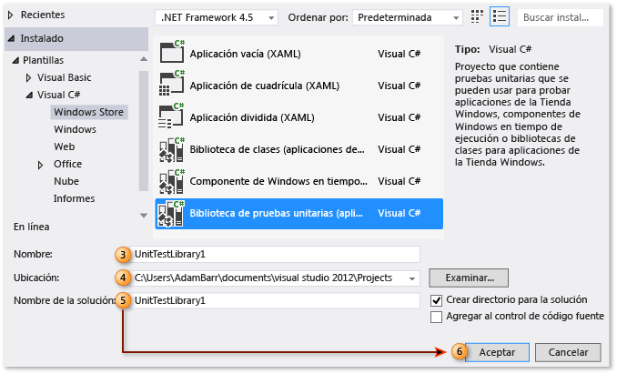
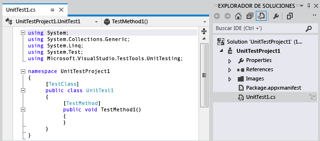
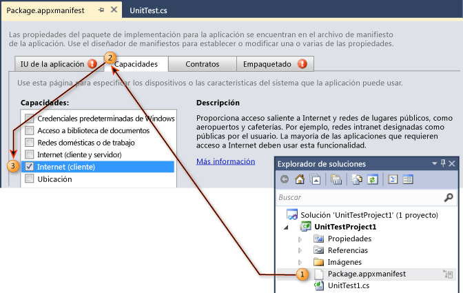
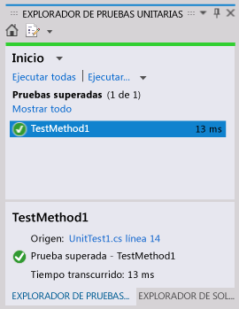

# Tutorial: Crear y ejecutar pruebas unitarias en aplicaciones para UWP
Visual Studio incluye compatibilidad para realizar pruebas unitarias de aplicaciones [!INCLUDE[win8_appname_long](../debugger/includes/win8_appname_long_md.md)] administradas e incluye plantillas de biblioteca de pruebas unitarias para Visual C#, Visual Basic y Visual C++.  
  
> [!TIP]
>  Para obtener más información sobre cómo desarrollar aplicaciones de [!INCLUDE[win8_appname_long](../debugger/includes/win8_appname_long_md.md)], consulte [Introducción a las aplicaciones para UWP](http://go.microsoft.com/fwlink/?LinkID=241410).  
  
 Visual Studio proporciona la siguiente funcionalidad de pruebas unitarias:  
  
-   [Crear proyectos de prueba unitaria](#CreateAndRunUnitTestWin8Tailored_Create)  
  
-   [Editar el manifiesto para el proyecto de prueba unitaria](#CreateAndRunUnitTestWin8Tailored_Manifest)  
  
-   [Programar la prueba unitaria](#CreateAndRunUnitTestWin8Tailored_Code)  
  
-   [Ejecutar pruebas unitarias](#CreateAndRunUnitTestWin8Tailored_Run)  
  
 Los procedimientos siguientes describen los pasos para crear, ejecutar y depurar pruebas unitarias para las aplicaciones [!INCLUDE[win8_appname_long](../debugger/includes/win8_appname_long_md.md)] de Windows 8 administradas.  
  
## Requisitos previos  
 Visual Studio  
  
##   Crear proyectos de prueba unitaria  
  
#### Crear un proyecto de prueba unitaria para una aplicación para UWP  
  
1.  En el menú **Archivo** , elija **Nuevo proyecto**.  
  
     Se muestra el cuadro de diálogo Nuevo proyecto.  
  
2.  En Plantillas, elija el lenguaje de programación en el que desea crear la prueba unitaria y, a continuación, elija la biblioteca de pruebas unitarias de [!INCLUDE[win8_appname_long](../debugger/includes/win8_appname_long_md.md)] asociada. Por ejemplo, elija **Visual C#** y, luego, **Windows Universal**. Por último, elija **Unit Test Library (Universal Windows)** (Biblioteca de pruebas unitarias [Windows Universal]).  
  
    > [!NOTE]
    >  Visual Studio incluye plantillas de biblioteca de pruebas unitarias para Visual C#, Visual Basic y Visual C++.  
  
3.  (Opcional) En el cuadro de texto **Nombre** , escriba el nombre que desee usar para el proyecto de prueba unitaria de [!INCLUDE[win8_appname_long](../debugger/includes/win8_appname_long_md.md)].  
  
4.  (Opcional) Modifique la ruta de acceso donde desee crear el proyecto escribiéndola en el cuadro de texto **Ubicación** o eligiendo el botón **Examinar** .  
  
5.  (Opcional) En el cuadro de texto nombre de **Solución** , escriba el nombre que desee usar para la solución.  
  
6.  Deje seleccionada la opción **Crear directorio para la solución** y elija el botón **Aceptar** .  
  
       
  
     El Explorador de soluciones se rellena con el nuevo proyecto de prueba unitaria de [!INCLUDE[win8_appname_long](../debugger/includes/win8_appname_long_md.md)] y el editor de código muestra la prueba unitaria predeterminada denominada UnitTest1.  
  
       
  
##   Editar el manifiesto para el proyecto de prueba unitaria  
 Puede ser necesario modificar el manifiesto para el proyecto de prueba unitaria con el fin de proporcionar las capacidades necesarias para ejecutar la aplicación.  
  
#### Editar el archivo de manifiesto de la aplicación para UWP del proyecto de prueba unitaria  
  
1.  En el Explorador de soluciones, en el nuevo proyecto de prueba unitaria de [!INCLUDE[win8_appname_long](../debugger/includes/win8_appname_long_md.md)] , haga clic con el botón secundario en el archivo de Package.appxmanifest y elija **Abrir**.  
  
     Aparece el diseñador de manifiestos para la edición.  
  
2.  En el diseñador de manifiestos, elija la pestaña **Capacidades** .  
  
3.  En la lista, en **Capacidades**, seleccione las capacidades que necesita la prueba unitaria y el código para las pruebas. Por ejemplo, active la casilla **Internet** si la prueba unitaria lo necesita y el código que está probando necesita tener la capacidad de tener acceso a Internet.  
  
    > [!NOTE]
    >  Las capacidades que seleccione deben incluir solo las capacidades necesarias para que la prueba unitaria de [!INCLUDE[win8_appname_long](../debugger/includes/win8_appname_long_md.md)] funcione correctamente. Las capacidades no deben incluir nunca funciones que no formen parte de la aplicación de [!INCLUDE[win8_appname_long](../debugger/includes/win8_appname_long_md.md)] que se esté probando y normalmente deben ser un subconjunto de las funciones especificadas para la aplicación de [!INCLUDE[win8_appname_long](../debugger/includes/win8_appname_long_md.md)] que está en pruebas.  
  
     Para obtener más información sobre el diseñador de manifiestos, consulte [Configurar un paquete de la aplicación de Windows 8.1 con el diseñador de manifiestos](http://msdn.microsoft.com/Library/24c58b7f-9c6d-41c3-b385-c1e8497d5b2d).  
  
       
  
##   Programar la prueba unitaria  
  
#### Codificar la prueba unitaria para una aplicación para UWP  
  
1.  En el Editor de código, edite la prueba unitaria y agregue las aserciones y la lógica requeridas para las pruebas.  
  
     Para obtener más información, consulte [Utilizar las clases Assert](http://go.microsoft.com/fwlink/?LinkID=224991) en MSDN Library.  
  
##   Ejecutar pruebas unitarias  
  
#### Para compilar la solución y ejecutar pruebas unitarias mediante el Explorador de pruebas  
  
1.  En el menú **Prueba** , seleccione **Windows**y, a continuación, elija **Explorador de pruebas**.  
  
     Aparece el Explorador de pruebas, pero no incluye la prueba.  
  
2.  En el menú **Compilar** , elija **Compilar solución**.  
  
     Ahora aparece la prueba unitaria.  
  
    > [!NOTE]
    >  Debe compilar la solución para actualizar la lista de pruebas unitarias en el Explorador de pruebas.  
  
    > [!WARNING]
    >  Problema conocido de Visual Studio: debe abrir el Explorador de pruebas antes de compilar el proyecto de prueba.  
  
3.  En el Explorador de pruebas, elija la prueba unitaria que creó.  
  
    > [!TIP]
    >  El Explorador de pruebas proporciona un vínculo al código fuente junto a **Origen:**.  
  
4.  Elija **Ejecutar todas**.  
  
       
  
    > [!TIP]
    >  Puede seleccionar una o varias de las pruebas unitarias enumeradas en el Explorador, hacer clic con el botón secundario y elegir **Ejecutar pruebas seleccionadas**.  
    >   
    >  Además, puede elegir **Depurar pruebas seleccionadas**, **Abrir prueba**y usar la opción **Propiedades** .  
    >   
    >    
  
     La prueba unitaria se ejecuta. Al finalizar, el Explorador de pruebas muestra el estado de la prueba y el tiempo transcurrido y proporciona un vínculo al origen.  
  
       
  
## Recursos externos  
  
### Vídeos  
 [Channel 9: Unit testing your UWP apps built using XAML (Channel 9: Prueba de las unidades de las aplicaciones para UWP compiladas mediante XAML)](http://go.microsoft.com/fwlink/?LinkId=226285)  
  
### Foros  
 [Prueba unitaria de Visual Studio](http://go.microsoft.com/fwlink/?LinkId=224477)  
  
### MSDN Library  
 [MSDN Library: Crear y ejecutar pruebas unitarias para código existente (Visual Studio 2010)](http://go.microsoft.com/fwlink/?LinkID=223683)  
  
## Vea también  
 [Testing UWP apps with Visual Studio (Probar aplicaciones para UWP con Visual Studio)](../test/testing-store-apps-with-visual-studio.md)   
 [Build and test a UWP app using Team Foundation Build (Compilar y probar una aplicación para UWP mediante Team Foundation Build)](http://msdn.microsoft.com/Library/d0ca17bb-deae-4f3d-a18d-1a99bebceaa9)
