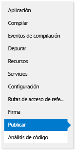
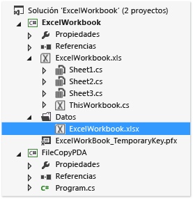
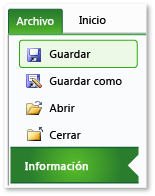
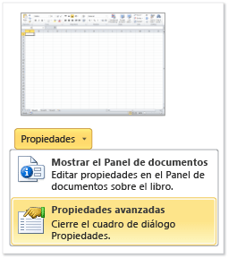
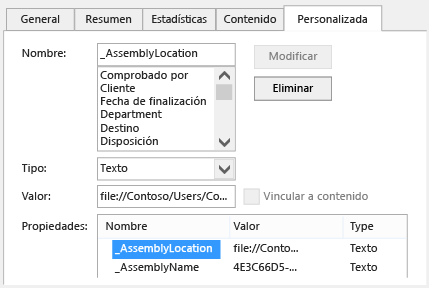

# Implementar una soluci&#243;n de Office mediante ClickOnce
  Puede implementar su solución de Office en menos pasos si usa ClickOnce.  Si publica actualizaciones, la solución las detectará e instalará automáticamente.  Sin embargo, ClickOnce requiere que instale la solución por separado para cada usuario de un equipo.  Por tanto, debería considerar usar Windows Installer \(.msi\) si más de un usuario ejecuta la solución en el mismo equipo.  
  
## En este tema  
  
-   [Publicar la solución](#Publish)  
  
-   [Decidir cómo conceder confianza a la solución](#Trust)  
  
-   [Ayudar a los usuarios a instalar la solución](#Helping)  
  
-   [Colocar el documento de una solución en el equipo del usuario final (solo para personalizaciones de nivel de documento)](#Put)  
  
-   [Colocar el documento de una solución en un servidor que ejecute SharePoint (solo para personalizaciones de nivel de documento)](#SharePoint)  
  
-   [Crear un instalador personalizado](#Custom)  
  
-   [Publicar una actualización](#Update)  
  
-   [Cambiar la ubicación de instalación de una solución](#Location)  
  
-   [Revertir una solución a una versión anterior](#Roll)  
  
 Para obtener más información acerca de cómo implementar una solución de Office creando un archivo de Windows Installer, consulte[Implementar una solución de Office mediante Windows Installer](../vsto/deploying-an-office-solution-by-using-windows-installer.md).  
  
##  <a name="Publish"></a> Publicar la solución  
 Puede publicar la solución mediante el **Asistente para publicación** o el **Diseñador de proyectos**.  En este procedimiento, utilizará el **Diseñador de proyectos** porque proporciona el conjunto completo de opciones de publicación.  Consulte [Asistente para publicación &#40;Desarrollo de Office en Visual Studio&#41;](../vsto/publish-wizard-office-development-in-visual-studio.md)  
  
#### Para publicar la solución  
  
1.  En el **Explorador de soluciones**, elija el nodo con el nombre de su proyecto.  
  
2.  En la barra de menús, elija **Proyecto**, *NombreDeProyecto***Propiedades**.  
  
3.  En el **Diseñador de proyectos**, elija la pestaña **Publicar**, que se muestra en la siguiente ilustración.  
  
       
  
4.  En el cuadro **Ubicación de la carpeta de publicación \(servidor FTP o ruta de archivo\)**, escriba la ruta de acceso a la carpeta donde desea que el **Diseñador de proyectos** copie los archivos de la solución.  
  
     Puede especificar cualquiera de los siguientes tipos de rutas.  
  
    -   Una ruta de acceso local \(por ejemplo, *C:\\NombreDeCarpeta\\NombreDeCarpeta*\).  
  
    -   Una ruta UNC \(Convención de nomenclatura uniforme\) a una carpeta en la red \(por ejemplo, *\\\\NombreDeServidor\\NombreDeCarpeta*\).  
  
    -   Ruta de acceso relativa \(por ejemplo, *CarpetaDePublicación\\*, que es la carpeta en la que se publica el proyecto de forma predeterminada\).  
  
5.  En el cuadro **Dirección URL de la carpeta de instalación**, escriba la ruta de acceso completa de la ubicación donde los usuarios finales encontrarán su solución.  
  
     Si no conoce aún la ubicación, no especifique nada en este campo.  De forma predeterminada, ClickOnce busca actualizaciones en la carpeta en la que los usuarios instalan la solución.  
  
6.  Elija el botón **Requisitos previos**.  
  
7.  En el cuadro de diálogo **Requisitos previos**, asegúrese de que está activada la casilla **Crear programa de instalación para instalar los componentes necesarios**.  
  
8.  En la lista **Elegir los requisitos previos que se van a instalar**, active las casillas de **Windows Installer 4.5** y del paquete de .NET Framework correspondiente.  
  
     Por ejemplo, si la solución tiene como destino [!INCLUDE[net_v45](../vsto/includes/net-v45-md.md)], active las casillas de **Windows Installer 4.5** y **Microsoft .NET Framework 4.5 \(versión completa\)**.  
  
9. Si la solución tiene como destino .NET Framework 4.5, active también la casilla **Runtime de Microsoft Visual Studio 2010 Tools para Office**.  
  
    > [!NOTE]  
    >  De forma predeterminada, esta casilla no aparece.  Para mostrar esta casilla, debe crear un paquete de programa previo.  Consulte cómo [crear un paquete de programa previo para un complemento VSTO de Office 2013 con Visual Studio 2012](http://blogs.msdn.com/b/vsto/archive/2012/12/21/creating-a-bootstrapper-package-for-an-office-2013-vsto-add-in-with-visual-studio-2012.aspx).  
  
10. En **Especificar la ubicación de instalación de los requisitos previos**, elija una de las opciones que aparecen y elija el botón **Aceptar**.  
  
     En la siguiente tabla se describe cada una de las opciones.  
  
    |Opción|Descripción|  
    |------------|-----------------|  
    |**Descargar los requisitos previos del sitio web del proveedor de los componentes**|Se pedirá al usuario que descargue e instale estos requisitos previos del proveedor.|  
    |**Descargar los requisitos previos desde la misma ubicación que mi aplicación**|El software necesario se instala con la solución.  Si elige esta opción, Visual Studio copia automáticamente todos los paquetes de requisitos previos en la ubicación de publicación.  Para que esta opción funcione, los paquetes se deben encontrar en el equipo de desarrollo.|  
    |**Descargar requisitos previos de la siguiente ubicación**|Visual Studio copia todos los paquetes de requisitos previos en la ubicación especificada y los instala con la solución.|  
  
     Consulte [Cuadro de diálogo Requisitos previos](../ide/reference/prerequisites-dialog-box.md)  
  
11. Elija el botón **Actualizaciones**, especifique la frecuencia con la que se desea que cada complemento de VSTO o personalización del usuario final compruebe si hay actualizaciones y elija el botón **Aceptar**.  
  
    > [!NOTE]  
    >  Si va a realizar la implementación desde un CD o una unidad extraíble, elija el botón de opción **No comprobar nunca si hay actualizaciones**.  
  
     Para obtener información sobre cómo publicar una actualización, vea [Publicar una actualización](#Update).  
  
12. Elija el botón **Opciones**, revise las opciones del cuadro de diálogo **Opciones** y elija el botón **Aceptar**.  
  
13. Elija el botón **Publicar ahora**.  
  
     Visual Studio agrega las siguientes carpetas y archivos a la carpeta de publicación especificada anteriormente en este procedimiento.  
  
    -   La carpeta **Archivos de aplicación**  
  
    -   El programa de instalación  
  
    -   Un manifiesto de implementación que apunta al manifiesto de implementación de la última versión  
  
     La carpeta **Archivos de aplicación** contiene una subcarpeta para cada versión que se publica.  Cada subcarpeta específica de la versión contiene los archivos siguientes.  
  
    -   Un manifiesto de aplicación  
  
    -   Un manifiesto de implementación  
  
    -   Ensamblados de personalización  
  
     En la siguiente ilustración se muestra la estructura de la carpeta de publicación de un complemento de VSTO de Outlook.  
  
       
  
    > [!NOTE]  
    >  ClickOnce anexa la extensión .deploy a los ensamblados para que una instalación segura de Internet Information Services \(IIS\) no bloquee los archivos debido a que contienen una extensión no segura.  Cuando el usuario instale la solución, ClickOnce quitará la extensión .deploy.  
  
14. Copie los archivos de la solución en la ubicación de instalación especificada anteriormente en este procedimiento.  
  
##  <a name="Trust"></a> Decidir cómo conceder confianza a la solución  
 Para que una solución pueda ejecutarse en los equipos de los usuarios, debe conceder confianza o los usuarios deben responder al mensaje relativo a la confianza cuando instalen la solución.  Para conceder confianza a la solución, firme los manifiestos mediante un certificado que identifique un publicador de confianza conocido.  Vea [Confirmando la solución firmar la aplicación y los manifiestos de implementación](../vsto/granting-trust-to-office-solutions.md#Signing).  
  
 Si va a implementar una personalización de nivel de documento y desea colocar el documento en una carpeta del equipo del usuario o hacer que el documento esté disponible en un sitio de SharePoint, asegúrese de que Office confíe en la ubicación del documento.  Consulte [Otorgar confianza a los documentos](../vsto/granting-trust-to-documents.md).  
  
##  <a name="Helping"></a> Ayudar a los usuarios a instalar la solución  
 Los usuarios pueden instalar la solución ejecutando el programa de instalación, abriendo el manifiesto de implementación o, en el caso de una personalización de nivel de documento, abriendo el documento directamente.  El procedimiento recomendado es que los usuarios instalen la solución mediante el programa de instalación.  Los otros dos enfoques no garantizan que se instale el software necesario.  Si los usuarios desean abrir el documento desde la ubicación de instalación, deben agregarlo a la lista de ubicaciones de confianza en el Centro de confianza de la aplicación de Office.  
  
### Abrir el documento de una personalización de nivel de documento  
 Los usuarios pueden abrir el documento de una personalización de nivel de documento directamente desde la ubicación de instalación o copiando el documento en el equipo local y después abriendo la copia.  
  
 Como procedimiento recomendado, los usuarios deben abrir una copia del documento en sus equipos para impedir que varios usuarios intenten abrir la misma copia al mismo tiempo.  Para aplicar esta práctica recomendada, puede configurar el programa de instalación de forma que copie el documento en los equipos de los usuarios.  Vea [Colocar el documento de una solución en el equipo del usuario final (solo para personalizaciones de nivel de documento)](#Put).  
  
### Instalar la solución abriendo el manifiesto de implementación desde un sitio web de IIS  
 Los usuarios pueden instalar una solución de Office abriendo el manifiesto de implementación desde la Web.  Sin embargo, una instalación segura de Internet Information Services \(IIS\) bloqueará los archivos que tengan la extensión .vsto.  El tipo MIME se debe definir en IIS para poder implementar una solución de Office mediante IIS.  
  
##### Para agregar el tipo MIME .vsto a IIS 6.0  
  
1.  En el servidor que ejecuta IIS 6.0, elija **Inicio**, **Todos los programas**, **Herramientas administrativas**, **Administrador de Internet Information Services \(IIS\)**.  
  
2.  Elija el nombre del equipo, la carpeta **Sitios web** o el sitio web que está configurando.  
  
3.  En la barra de menús, elija **Acción**, **Propiedades**.  
  
4.  En la pestaña **Encabezados HTTP**, elija el botón **Tipos MIME**.  
  
5.  En la ventana **Tipos MIME**, elija el botón **Nuevo**.  
  
6.  En la ventana **Tipo MIME**, escriba **.vsto** para la extensión, escriba **application\/x\-ms\-vsto** para el tipo MIME y, a continuación, aplique la nueva configuración.  
  
    > [!NOTE]  
    >  Para que los cambios surtan efecto, debe reiniciar el Servicio de publicación World Wide Web o esperar hasta que el proceso de trabajo se recicle.  Debe vaciar la memoria caché del disco del explorador y después intentar abrir de nuevo el archivo .vsto.  
  
##### Para agregar el tipo MIME .vsto a IIS 7,0  
  
1.  En el servidor que ejecuta IIS 7.0, elija **Inicio**, **Todos los programas**, **Accesorios**.  
  
2.  Abra el menú contextual de **Símbolo del sistema** y, a continuación, elija **Ejecutar como administrador**.  
  
3.  En el cuadro **Abrir**, escriba la siguiente ruta de acceso y después elija el botón **Aceptar**.  
  
    ```  
    %windir%\system32\inetsrv   
    ```  
  
4.  Escriba el comando siguiente y, a continuación, aplique la nueva configuración.  
  
    ```  
    set config /section:staticContent /+[fileExtension='.vsto',mimeType='application/x-ms-vsto']  
    ```  
  
    > [!NOTE]  
    >  Para que los cambios surtan efecto, debe reiniciar el Servicio de publicación World Wide Web o debe esperar hasta que el proceso de trabajo se recicle.  Debe vaciar la memoria caché del disco del explorador y después intentar abrir de nuevo el archivo .vsto.  
  
##  <a name="Put"></a> Colocar el documento de una solución en el equipo del usuario final \(solo para personalizaciones de nivel de documento\)  
 Puede copiar el documento de la solución en el equipo del usuario final creando una acción posterior a la implementación.  De esta manera, el usuario no tendrá que copiar manualmente el documento desde la ubicación de instalación en el equipo después de instalar la solución.  Tendrá que crear una clase que defina la acción posterior a la implementación, compilar y publicar la solución, modificar el manifiesto de la aplicación y volver a firmar el manifiesto de la aplicación y de la implementación.  
  
 En los procedimientos siguientes se presupone que el nombre del proyecto es **ExcelWorkbook** y que la solución se publica en el directorio **C:\\publish** del equipo.  
  
### Crear una clase que defina la acción posterior a la implementación  
  
1.  En la barra de menús, elija **Archivo**, **Agregar**, **Nuevo proyecto**.  
  
2.  En el cuadro de diálogo **Agregar nuevo proyecto**, en el panel **Plantillas instaladas**, elija la carpeta **Windows**.  
  
3.  En el panel **Plantillas**, elija la plantilla **Biblioteca de clases**.  
  
4.  En el campo **Nombre**, escriba **FileCopyPDA** y elija el botón **Aceptar**.  
  
5.  En el **Explorador de soluciones**, elija el proyecto **FileCopyPDA**.  
  
6.  En la barra de menús, elija **Proyecto**, **Agregar referencia**.  
  
7.  En la pestaña **.NET**, agregue referencias a Microsoft.VisualStudio.Tools.Applications.Runtime y Microsoft.VisualStudio.Tools.Applications.ServerDocument.  
  
8.  Cambie el nombre de la clase a `FileCopyPDA` y reemplace el contenido del archivo con el código.  Este código realiza las tareas siguientes:  
  
    -   Copia el documento en el escritorio del usuario.  
  
    -   Cambia la propiedad \_AssemblyLocation de una ruta de acceso relativa a una ruta de acceso completa para el manifiesto de implementación.  
  
    -   Elimina el archivo si el usuario desinstala la solución.  
  
     [!code-csharp[Trin_ExcelWorkbookPDA#7](../snippets/csharp/VS_Snippets_OfficeSP/trin_excelworkbookpda/cs/filecopypda/class1.cs#7)]
     [!code-vb[Trin_ExcelWorkbookPDA#7](../snippets/visualbasic/VS_Snippets_OfficeSP/trin_excelworkbookpda/vb/filecopypda/class1.vb#7)]  
  
### Compilar y publicar la solución  
  
1.  En el **Explorador de soluciones**, abra el menú contextual del proyecto **FileCopyPDA** y elija **Compilar**.  
  
2.  Abra el menú contextual del proyecto **ExcelWorkbook** y después elija **Compilar**.  
  
3.  Abra el menú contextual del nodo de proyecto **ExcelWorkbook** y, a continuación, elija **Agregar referencia**.  
  
4.  En el cuadro de diálogo **Agregar referencia**, elija la pestaña **Proyectos**, elija **FileCopyPDA** y elija el botón **Aceptar**.  
  
5.  En el **Explorador de soluciones**, elija el proyecto **ExcelWorkbook**.  
  
6.  En la barra de menús, elija **Proyecto**, **Nueva carpeta**.  
  
7.  Escriba Data y elija la tecla Entrar.  
  
8.  En el **Explorador de soluciones**, elija la carpeta **Data**.  
  
9. En la barra de menús, elija **Proyecto**, **Agregar elemento existente**.  
  
10. En el cuadro de diálogo **Agregar elemento existente**, vaya al directorio de salida del proyecto **ExcelWorkbook**, elija el archivo **ExcelWorkbook.xlsx** y después elija el botón **Agregar**.  
  
11. En el **Explorador de soluciones**, elija el archivo **ExcelWorkbook.xlsx**.  
  
12. En la ventana **Propiedades**, cambie la propiedad **Acción de compilación** a **Contenido** y la propiedad **Copiar en el directorio de salida** a **Copiar si es posterior**.  
  
     Cuando haya completado estos pasos, el proyecto será similar al que se muestra en la siguiente ilustración.  
  
       
  
13. Publique el proyecto **ExcelWorkbook**.  
  
### Modificar el manifiesto de aplicación  
  
1.  Abra el directorio **c:\\publish** mediante el **Explorador de archivos**.  
  
2.  Abra la carpeta **Archivos de aplicación** y después abra la carpeta correspondiente a la versión publicada más reciente de la solución.  
  
3.  Abra el archivo **ExcelWorkbook.dll.manifest** en un editor de texto como el Bloc de notas.  
  
4.  Agregue el código siguiente detrás del elemento `</vstav3:update>`.  Para el atributo de clase del elemento `<vstav3:entryPoint>`, emplee la sintaxis siguiente: *NombreDeEspacioDeNombres.NombreDeClase*.  En el ejemplo siguiente, los nombres de clase y espacio de nombres son los mismos, por lo que el nombre del punto de entrada resultante es `FileCopyPDA.FileCopyPDA`.  
  
    ```  
    <vstav3:postActions>  
      <vstav3:postAction>  
        <vstav3:entryPoint  
          class="FileCopyPDA.FileCopyPDA">  
          <assemblyIdentity  
            name="FileCopyPDA"  
            version="1.0.0.0"  
            language="neutral"  
            processorArchitecture="msil" />  
        </vstav3:entryPoint>  
        <vstav3:postActionData>  
        </vstav3:postActionData>  
      </vstav3:postAction>  
    </vstav3:postActions>  
    ```  
  
### Volver a firmar los manifiestos de aplicación e implementación  
  
1.  En la carpeta **%USERPROFILE%\\Documents\\Visual Studio 2013\\Projects\\ExcelWorkbook\\ExcelWorkbook**, copie el archivo de certificado **ExcelWorkbook\_TemporaryKey.pfx** y luego péguelo en la carpeta *CarpetaDePublicación* **\\Archivos de aplicación\\ExcelWorkbook***VersiónPublicadaMásReciente*.  
  
2.  Abra el símbolo del sistema de Visual Studio y cambie los directorios a la carpeta **c:\\publish\\Archivos de aplicación\\ExcelWorkbook***VersiónPublicadaMásReciente* \(por ejemplo, **c:\\publish\\Archivos de aplicación\\ExcelWorkbook\_1\_0\_0\_4**\).  
  
3.  Firme el manifiesto de aplicación modificado ejecutando el siguiente comando:  
  
    ```  
    mage -sign ExcelWorkbook.dll.manifest -certfile ExcelWorkbook_TemporaryKey.pfx  
    ```  
  
     Aparece el mensaje "ExcelWorkbook.dll.manifest firmado correctamente".  
  
4.  Cambie a la carpeta **c:\\publish** y, a continuación, actualice y firme el manifiesto de implementación ejecutando el comando siguiente:  
  
    ```  
    mage -update ExcelWorkbook.vsto -appmanifest "Application Files\Ex  
    celWorkbookMostRecentVersionNumber>\ExcelWorkbook.dll.manifest" -certfile "Application Files\ExcelWorkbookMostRecentVersionNumber>\ExcelWorkbook_TemporaryKey.pfx"  
    ```  
  
    > [!NOTE]  
    >  En el ejemplo anterior, reemplace MostRecentVersionNumber con el número de versión de la versión publicada más recientemente de la solución \(por ejemplo, **1\_0\_0\_4**\).  
  
     Aparece el mensaje "ExcelWorkbook.vsto firmado correctamente".  
  
5.  Copie el archivo ExcelWorkbook.vsto en el directorio **c:\\publish\\Archivos de aplicación\\ExcelWorkbook***VersiónPublicadaMásReciente*.  
  
##  <a name="SharePoint"></a> Colocar el documento de una solución en un servidor que ejecute SharePoint \(solo para personalizaciones de nivel de documento\)  
 Puede publicar la personalización de nivel de documento para los usuarios finales mediante SharePoint.  Cuando los usuarios van al sitio de SharePoint y abren el documento, el runtime instala automáticamente la solución desde la carpeta de red compartida en el equipo local del usuario.  Una vez instalada localmente la solución, la personalización seguirá funcionando aunque el documento se copie en otra parte, como el escritorio.  
  
#### Para colocar el documento en un servidor que ejecuta SharePoint  
  
1.  Agregue el documento de la solución a una biblioteca de documentos en un sitio de SharePoint.  
  
2.  Siga los pasos de alguno de estos enfoques:  
  
    -   Utilice la herramienta de configuración de Office para agregar el servidor que ejecuta SharePoint al Centro de confianza de Word o Excel en todos los equipos de los usuarios.  
  
         Consulte las [directivas y configuración de seguridad de Office 2010](http://go.microsoft.com/fwlink/?LinkId=99227).  
  
    -   Asegúrese de que cada usuario realice los pasos siguientes.  
  
        1.  En el equipo local, abra Word o Excel, elija la pestaña **Archivo** y después elija el botón **Opciones**.  
  
        2.  En el cuadro de diálogo **Centro de confianza**, elija el botón **Ubicaciones de confianza**.  
  
        3.  Active la casilla **Permitir ubicaciones de confianza que estén en la red \(no recomendado\)** y después elija el botón **Agregar nueva ubicación**.  
  
        4.  En el cuadro **Ruta de acceso**, escriba la dirección URL de la biblioteca de documentos de SharePoint que contiene el documento cargado \(por ejemplo, *http:\/\/NombreDeServidorDeSharePoint\/NombreDeEquipo\/NombreDeProyecto\/NombreDeBibliotecaDeDocumentos*\).  
  
             No agregue el nombre de la página web predeterminada, como default.aspx o AllItems.aspx.  
  
        5.  Active la casilla **Las subcarpetas de esta ubicación también son de confianza** y después elija el botón **Aceptar**.  
  
             Cuando los usuarios abran el documento desde el sitio de SharePoint, se abrirá el documento y se instalará la personalización.  Los usuarios pueden copiar el documento en el escritorio.  La personalización se ejecutará igualmente porque las propiedades del documento apuntan a la ubicación de red del documento.  
  
##  <a name="Custom"></a> Crear un instalador personalizado  
 Puede crear un instalador personalizado para la solución de Office en lugar de utilizar el programa de instalación que se crea automáticamente cuando se publica la solución.  Por ejemplo, podría usar un script de inicio de sesión para iniciar la instalación o podría usar un archivo por lotes para instalar la solución sin interacción del usuario.  Estos escenarios funcionan mejor si los requisitos previos ya están instalados en los equipos de los usuarios finales.  
  
 Como parte del proceso de instalación personalizada, llame a la herramienta de instalación de soluciones de Office \(VSTOInstaller.exe\), que se instala en la siguiente ubicación de forma predeterminada:  
  
 %commonprogramfiles%\\microsoft shared\\VSTO\\10.0\\VSTOInstaller.exe  
  
 Si la herramienta no está en esa ubicación, puede usar la clave del Registro HKEY\_LOCAL\_MACHINE\\SOFTWARE\\Microsoft\\VSTO Runtime Setup\\v4\\InstallerPath o HKEY\_LOCAL\_MACHINE\\SOFTWARE\\Wow6432Node\\Microsoft\\VSTO Runtime Setup\\v4\\InstallerPath para encontrar la ruta de acceso a esa herramienta.  
  
 Puede utilizar los siguientes parámetros con VSTOinstaller.exe.  
  
|Parámetro|Definición|  
|---------------|----------------|  
|\/Install o \/I|Instala la solución.  Esta opción debe ir seguida de la ruta de acceso de un manifiesto de implementación.  Puede especificar una ruta de acceso en el equipo local —un recurso compartido de archivos de convención de nomenclatura universal \(UNC\)—.  Puede especificar una ruta de acceso local \(*C:\\NombreDeCarpeta\\CarpetaDePublicación*\), una ruta de acceso relativa \(*Publish\\*\) o una ubicación completa \(*\\\\NombreDeServidor\\NombreDeCarpeta* o http:\/\/*NombreDeServidor\/NombreDeCarpeta*\).|  
|\/Uninstall o \/U|Desinstala la solución.  Esta opción debe ir seguida de la ruta de acceso de un manifiesto de implementación.  Puede especificar que una ruta de acceso puede estar en el equipo local, en un recurso compartido de archivos UNC.  Puede especificar una ruta de acceso local \(*c:\\NombreDeCarpeta\\CarpetaDePublicación*\), una ruta de acceso relativa \(*Publish\\*\) o una ubicación completa \(*\\\\NombreDeServidor\\NombreDeCarpeta* o http:\/\/*NombreDeServidor\/NombreDeCarpeta*\).|  
|\/Silent o \/S|Instala o desinstala sin solicitar la entrada de datos del usuario ni mostrar ningún mensaje.  Si se requiere un mensaje relativo a la confianza, la personalización no se instala ni se actualiza.|  
|\/Help o \/?|Muestra la información de Ayuda.|  
  
 Cuando ejecute VSTOinstaller.exe, pueden aparecer los códigos de error siguientes.  
  
|Código de error|Definición|  
|---------------------|----------------|  
|0|La solución se instaló o desinstaló correctamente o se mostró la Ayuda de VSTOInstaller.|  
|\-100|Una o más opciones de la línea de comandos no son válidas o se establecieron más de una vez.  Para obtener más información, escriba "vstoinstaller \/?" o consulte [Crear un instalador personalizado para una solución de Office ClickOnce](http://msdn.microsoft.com/es-es/3e5887ed-155f-485d-b8f6-3c02c074085e).|  
|\-101|Una o más opciones de la línea de comandos no son válidas.  Para obtener más información, escriba “vstoinstaller\/?”.|  
|\-200|El URI del manifiesto de implementación no es válido.  Para obtener más información, escriba “vstoinstaller\/?”.|  
|\-201|No se pudo instalar la solución porque el manifiesto de implementación no es válido.  Consulte [Manifiestos de implementación para soluciones de Office](../vsto/deployment-manifests-for-office-solutions.md)|  
|\-202|No se pudo instalar la solución porque la sección Visual Studio Tools para Office del manifiesto de aplicación no es válida.  Consulte [Manifiestos de aplicación para soluciones de Office](../vsto/application-manifests-for-office-solutions.md)|  
|\-203|No se pudo instalar la solución debido a un error en la descarga.  Compruebe el URI o la ubicación del archivo de red del manifiesto de implementación e inténtelo de nuevo.|  
|\-300|No se pudo instalar la solución debido a una excepción de seguridad.  Consulte [Asegurar las soluciones de Office](../vsto/securing-office-solutions.md).|  
|\-400|No se pudo instalar la solución.|  
|\-401|No se pudo desinstalar la solución.|  
|\-500|Se ha cancelado la operación porque no se pudo instalar o desinstalar la solución o porque no se pudo descargar el manifiesto de implementación.|  
  
##  <a name="Update"></a> Publicar una actualización  
 Para actualizar una solución, publíquela de nuevo mediante el **Diseñador de proyectos** o el **Asistente para publicación** y después copie la solución actualizada en la ubicación de instalación.  Cuando copie los archivos en la ubicación de instalación, asegúrese de sobrescribir los archivos anteriores.  
  
 La próxima vez que la solución compruebe si hay una actualización, buscará y cargará la nueva versión automáticamente.  
  
##  <a name="Location"></a> Cambiar la ubicación de instalación de una solución  
 Puede agregar o cambiar la ruta de instalación después de publicar una solución.  Puede cambiar la ruta de instalación por alguna de las siguientes razones:  
  
-   El programa de instalación se compiló antes de que se conociera la ruta de instalación.  
  
-   Los archivos de la solución se han copiado en otra ubicación.  
  
-   El servidor que hospeda los archivos de instalación tiene un nombre o una ubicación nuevos.  
  
 Para cambiar la ruta de instalación de una solución, debe actualizar el programa de instalación. Los usuarios tendrán que ejecutar este programa.  Para las personalizaciones de nivel de documento, los usuarios también deben actualizar una propiedad en el documento para que apunte a la nueva ubicación.  
  
> [!NOTE]  
>  Si no desea pedir a los usuarios que actualicen las propiedades del documento, pídales que obtengan el documento actualizado de la ubicación de instalación.  
  
#### Para cambiar la ruta de instalación en el programa de instalación  
  
1.  Abra una ventana de **símbolo del sistema** y después cambie los directorios a la carpeta de instalación.  
  
2.  Ejecute el programa de instalación e incluya el parámetro `/url`, que toma la nueva ruta de instalación como una cadena.  
  
     En el ejemplo siguiente se muestra cómo cambiar la ruta de instalación a una ubicación del sitio web de Fabrikam, pero puede reemplazar esa dirección URL por la ruta que desee:  
  
    ```  
    setup.exe /url="http://www.fabrikam.com/newlocation"  
    ```  
  
    > [!NOTE]  
    >  Si aparece un mensaje y se indica que la firma del archivo ejecutable se va a invalidar, el certificado utilizado para firmar la solución ya no es válido y se desconoce el publicador.  Como resultado, los usuarios deberán confirmar que confían en el origen de la solución para poder instalarla.  
  
    > [!NOTE]  
    >  Para mostrar el valor actual de la dirección URL, ejecute `setup.exe /url`.  
  
 Para las personalizaciones de nivel de documento, los usuarios deben abrir el documento y después actualizar la propiedad \_AssemblyLocation.  Los pasos siguientes describen cómo los usuarios pueden realizar esta tarea.  
  
#### Para actualizar la propiedad \_AssemblyLocation en un documento  
  
1.  En la pestaña **Archivo**, elija **Información**, que se muestra en la siguiente ilustración.  
  
       
  
2.  En la lista **Propiedades**, elija **Propiedades avanzadas**, que se muestra en la siguiente ilustración.  
  
       
  
3.  En la pestaña **Personalizado**, en la lista **Propiedades**, elija \_AssemblyLocation, como se muestra en la siguiente ilustración.  
  
       
  
     El cuadro **Valor** contiene el identificador del manifiesto de implementación.  
  
4.  Delante del identificador, escriba la ruta de acceso completa del documento seguida de una barra, con el formato *Ruta* |*Identificador* \(por ejemplo, *File:\/\/NombreDeServidor\/NombreDeCarpeta\/NombreDeArchivo |74744e4b\-e4d6\-41eb\-84f7\-ad20346fe2d9*.  
  
     Para obtener más información acerca de cómo dar formato a este identificador, consulte [Información general sobre propiedades personalizadas del documento](../vsto/custom-document-properties-overview.md).  
  
5.  Elija el botón **Aceptar** y después guarde y cierre el documento.  
  
6.  Ejecute el programa de instalación sin el parámetro \/url para instalar la solución en la ubicación especificada.  
  
##  <a name="Roll"></a> Revertir una solución a una versión anterior  
 Cuando se revierte una solución, se revierte a los usuarios a una versión anterior de la solución.  
  
#### Para revertir una solución  
  
1.  Abra la ubicación de instalación de la solución.  
  
2.  En la carpeta de publicación de nivel superior, elimine el manifiesto de implementación \(el archivo .vsto\).  
  
3.  Busque la subcarpeta correspondiente a la versión a la que desea efectuar la reversión.  
  
4.  Copie el manifiesto de implementación de esa subcarpeta en la carpeta de publicación de nivel superior.  
  
     Por ejemplo, para revertir una solución denominada **OutlookAddIn1** de la versión 1.0.0.1 a la versión 1.0.0.0, copie el archivo **OutlookAddIn1.vsto** de la carpeta **OutlookAddIn1\_1\_0\_0\_0**.  Pegue el archivo en la carpeta de publicación de nivel superior, sobrescribiendo el manifiesto de implementación específico de la versión de **OutlookAddIn1\_1\_0\_0\_1** que ya estaba allí.  
  
     La ilustración siguiente muestra la estructura de carpetas de publicación de este ejemplo.  
  
       
  
     La próxima vez que un usuario abra la aplicación o el documento personalizado se detectará el cambio del manifiesto de implementación.  La versión anterior de la solución de Office se ejecutará desde la caché de ClickOnce.  
  
> [!NOTE]  
>  Los datos locales se guardan para una sola versión anterior de una solución.  Si revierte a la segunda versión anterior, los datos locales no se conservan.  Para obtener más información acerca de los datos locales, consulte [Obtener acceso local o remoto a los datos en aplicaciones ClickOnce](../deployment/accessing-local-and-remote-data-in-clickonce-applications.md).  
  
## Vea también  
 [Implementar una solución de Office](../vsto/deploying-an-office-solution.md)   
 [Publicar soluciones de Office](../vsto/deploying-an-office-solution-by-using-clickonce.md)   
 [Cómo: Publicar una solución de Office usando ClickOnce](http://msdn.microsoft.com/es-es/2b6c247e-bc04-4ce4-bb64-c4e79bb3d5b8)   
 [Cómo: Instalar una solución de Office ClickOnce](http://msdn.microsoft.com/es-es/14702f48-9161-4190-994c-78211fe18065)   
 [Cómo: Publicar una solución de Office de nivel de documento en un servidor de SharePoint usando ClickOnce](http://msdn.microsoft.com/es-es/2408e809-fb78-42a1-9152-00afa1522e58)   
 [Crear un instalador personalizado para una solución de Office ClickOnce](http://msdn.microsoft.com/es-es/3e5887ed-155f-485d-b8f6-3c02c074085e)  
  
  