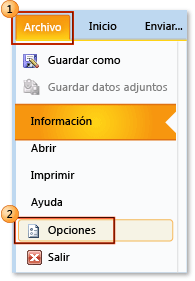

# C&#243;mo: Mostrar la pesta&#241;a Programador en la cinta de opciones
  Para tener acceso a la pestaña **Desarrollador** de la cinta de opciones de una aplicación de Office, debe configurarla para que se muestre esa pestaña, ya que no aparece de forma predeterminada.  Por ejemplo, debe mostrar esa pestaña si desea agregar un <xref:Microsoft.Office.Tools.Word.GroupContentControl> a una personalización de nivel de documento para Word.  
  
> [!NOTE]  
>  Esta guía se aplica únicamente a aplicaciones de Office 2010 o versiones posteriores.  Si desea mostrar esta pestaña en el sistema de Microsoft Office 2007, consulte la siguiente versión del tema [Cómo: Mostrar la pestaña Programador en la cinta de opciones](http://msdn.microsoft.com/library/bb608625(v=vs.90).aspx).  
  
 [!INCLUDE[appliesto_ribbon](../vsto/includes/appliesto-ribbon-md.md)]  
  
> [!NOTE]  
>  Access no tiene ninguna pestaña **Desarrollador**.  
  
### Para mostrar la pestaña Desarrollador  
  
1.  Inicie cualquiera de las aplicaciones de Office compatibles con este tema.  Consulte la nota **Se aplica a:** que aparece anteriormente en este tema.  
  
2.  En la pestaña **Archivo**, elija el botón **Opciones**.  
  
     En la siguiente figura se muestra la pestaña **Archivo** y el botón **Opciones** de Office 2010.  
  
       
  
     En la siguiente figura se muestra la pestaña **Archivo** en Office 2013.  
  
       
  
     En la siguiente figura se muestra el botón **Opciones** en Office 2013.  
  
       
  
3.  En el cuadro de diálogo *Opciones* de **NombreAplicación**, seleccione el botón **Personalizar la cinta de opciones**.  
  
     En la siguiente figura se muestra el cuadro de diálogo **Opciones** y el botón **Personalizar la cinta de opciones** en Excel 2010.  La ubicación de este botón es similar en el resto de las aplicaciones que se enumeran en la sección "Se aplica a" cerca de la parte superior de este tema.  
  
       
  
4.  En la lista de pestañas principales, seleccione la casilla de verificación **Desarrollador**.  
  
     En la siguiente figura se muestra la casilla de verificación **Desarrollador** en Word 2010 y [!INCLUDE[Word_15_short](../vsto/includes/word-15-short-md.md)].  La ubicación de esta casilla de verificación es similar en el resto de las aplicaciones que se enumeran en la sección "Se aplica a" cerca de la parte superior de este tema.  
  
       
  
5.  Elija el botón **Aceptar** para cerrar el cuadro de diálogo **Opciones**.  
  
## Vea también  
 [Personalización de la interfaz de usuario de Office](../vsto/office-ui-customization.md)  
  
  