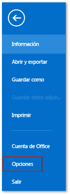
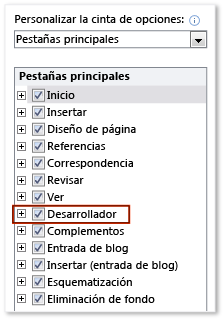

# Cómo: Mostrar la pestaña Programador en la cinta de opciones
  Para tener acceso a la **Developer** ficha en la cinta de opciones de una aplicación de Office, debe configurarlo para mostrar esa pestaña, ya que no aparece de forma predeterminada. Por ejemplo, debe mostrar esa pestaña si desea agregar un <xref:Microsoft.Office.Tools.Word.GroupContentControl> a una personalización de nivel de documento para Word.  
  
> [!NOTE]  
>  Esta guía se aplica únicamente a aplicaciones de Office 2010 o versiones posteriores. Si desea mostrar u ocultar esta ficha en 2007 Microsoft Office System, consulte la siguiente versión de este tema [Cómo: mostrar la pestaña Programador en la cinta de opciones](http://msdn.microsoft.com/library/bb608625(v=vs.90).aspx).  
  
 [!INCLUDE[appliesto_ribbon](../vsto/includes/appliesto-ribbon-md.md)]  
  
> [!NOTE]  
>  No tiene acceso a un **Developer** ficha.  
  
### Para mostrar la pestaña Desarrollador  
  
1.  Inicie cualquiera de las aplicaciones de Office compatibles con este tema. Consulte la **se aplica a:** Nota anteriormente en este tema.  
  
2.  En el **archivo** ficha, elija la **opciones** botón.  
  
     La siguiente ilustración muestra la **archivo** ficha y **opciones** botón de Office 2010.  
  
       
  
     La siguiente ilustración muestra la **archivo** ficha en Office 2013.  
  
       
  
     La siguiente ilustración muestra la **opciones** botón en Office 2013.  
  
       
  
3.  En el *ApplicationName***opciones** diálogo cuadro, elija la **personalizar la cinta de opciones** botón.  
  
     La siguiente ilustración muestra la **opciones** cuadro de diálogo y el **personalizar la cinta de opciones** botón en Excel 2010. La ubicación de este botón es similar en el resto de las aplicaciones que se enumeran en la sección "Se aplica a" cerca de la parte superior de este tema.  
  
       
  
4.  En la lista de pestañas principales, seleccione la **Developer** casilla de verificación.  
  
     La siguiente ilustración muestra la **Developer** casilla de verificación en Word 2010 y [!INCLUDE[Word_15_short](../vsto/includes/word-15-short-md.md)]. La ubicación de esta casilla de verificación es similar en el resto de las aplicaciones que se enumeran en la sección "Se aplica a" cerca de la parte superior de este tema.  
  
       
  
5.  Elija la **Aceptar** botón para cerrar la **opciones** cuadro de diálogo.  
  
## Vea también  
 [Personalización de la interfaz de usuario de Office](../vsto/office-ui-customization.md)  
  
  