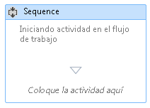
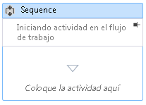

# Agregar comentarios a un flujo de trabajo en el Dise&#241;ador de flujo de trabajo
Para facilitar la creación de flujos de trabajo mayores y más complicados, [!INCLUDE[net_v45](../ide/includes/net_v45_md.md)] permite al desarrollador agregar anotaciones a los siguientes tipos de elemento en el diseñador:  
  
-   <xref:System.Activities.Activity>  
  
-   <xref:System.Activities.Statements.State>  
  
-   <xref:System.Activities.Statements.Transition>  
  
-   Clases derivadas de <xref:System.Activities.Statements.FlowNode>.  
  
-   <xref:System.Activities.Variable>  
  
-   <xref:System.Activities.Argument>  
  
> [!IMPORTANT]
>  El contenido de una anotación se guarda como texto sin formato en el archivo XAML asociado al flujo de trabajo y podrían leerlo otras personas.Tenga cuidado al especificar información confidencial en una anotación.  
  
### Agregar una anotación a una actividad en el diseñador  
  
1.  En el diseñador de flujo de trabajo, haga clic con el botón secundario en un elemento y seleccione **Anotaciones**, **Agregar anotación**.  
  
2.  Agregue el texto de la anotación en el espacio proporcionado.  
  
3.  El elemento mostrará un icono de anotación.Al mantener el mouse sobre el icono de anotación se mostrará el texto de la anotación.  
  
       
  
### Mostrar una anotación en el diseñador de una actividad  
  
1.  Con un diseñador de actividad que tiene una anotación que se muestra fuera de la actividad, haga clic en el icono **Anclar** en el Adorner de la anotación.  
  
2.  La anotación se mostrará en el diseñador de la actividad.En la captura de pantalla siguiente, la anotación "Iniciando actividad en el flujo de trabajo" se muestra en el diseñador de la actividad.  
  
       
  
3.  Para mostrar la anotación fuera del diseñador de actividades, mantenga el mouse sobre el área de anotación en el diseñador de actividades y haga clic en el icono **Desanclar**.  
  
       
  
### Mostrar u ocultar todas las anotaciones  
  
1.  Haga clic con el botón secundario en una actividad que tiene una anotación.Seleccione **Anotaciones**, **Mostrar todas las anotaciones**.  
  
2.  Todas las anotaciones se mostrarán en los diseñadores de la actividad.  
  
3.  Para mostrar todas las anotaciones fuera de los diseñadores de actividades, haga clic con el botón secundario en la actividad y seleccione **Anotaciones**, **Ocultar todas las anotaciones**.  
  
### Editar o eliminar una anotación para una actividad  
  
1.  Haga clic con el botón secundario en una actividad que tiene una anotación.  
  
2.  Seleccione **Anotaciones**, **Editar anotación** o **Eliminar anotación**.  
  
3.  La anotación se abrirá para editar o eliminar.  
  
4.  Para eliminar todas las anotaciones a la vez, haga clic con el botón secundario en el diseñador de flujo de trabajo y seleccione **Anotación**, **Eliminar todas las anotaciones**.  
  
### Agregar, editar y eliminar una anotación para una variable o argumento  
  
1.  Haga clic con el botón secundario en una variable o argumento y seleccione Agregar anotación.  
  
2.  Escriba el texto de la anotación.La variable o argumento mostrará un icono de anotación.  
  
3.  Haga clic con el botón secundario en una variable o argumento que tiene una anotación.Seleccione Editar anotación.  
  
4.  La anotación se abrirá para editar.  
  
5.  Haga clic con el botón secundario en una variable o argumento que tiene una anotación.Seleccione Eliminar anotación.  
  
6.  La anotación se eliminará.