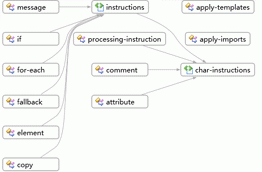

# C&#243;mo: Obtener informaci&#243;n general de un conjunto de esquemas mediante la vista Gr&#225;fico
[!INCLUDE[vs2017banner](../code-quality/includes/vs2017banner.md)]

En este tema se describe cómo utilizar la [vista Gráfico](../xml-tools/graph-view.md) para obtener una vista general de los nodos en un conjunto de esquemas y de las relaciones entre los nodos.  
  
### Para crear un nuevo archivo XSD y mostrar el elemento raíz en el vista Modelo de contenido  
  
1.  Cree un nuevo archivo de esquema XML y guarde el archivo como Relationships.xsd.  
  
2.  Haga clic en el vínculo **Use el Editor XML para ver y editar el archivo de esquema XML subyacente** en la vista Inicio.  
  
3.  Copie el código de ejemplo del Esquema XML desde [Esquema XML de ejemplo: Relaciones](../Topic/Sample%20XSD%20File:%20Relationships.md) y péguelo para reemplazar el código que se agregó de forma predeterminada al nuevo archivo XSD.  
  
4.  Haga clic con el botón secundario del mouse en cualquier parte del Editor XML y seleccione **Diseñador de vistas**.  
  
5.  Seleccione el vista Gráfico en la barra de herramientas XSD.  
  
6.  Seleccione el nodo **Conjunto de esquemas** en el Explorador de esquemas XML y arrastre el nodo hasta la superficie de diseño de la vista Gráfico.Debería ver todos los nodos globales y las flechas que conectan los nodos que tienen relaciones.  
  
       
  
7.  Haga clic en cualquier nodo de la superficie de diseño y busque en la barra de ruta de navegación dónde se encuentra el nodo seleccionado dentro del conjunto de esquemas.  
  
8.  Haga clic con el botón secundario en cualquier nodo del elemento de la superficie de diseño y seleccione **Generar XML de muestra** para ver el documento XML de instancia.