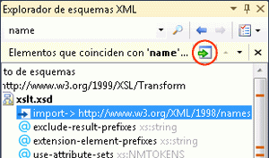

# Buscar el conjunto de esquemas

El **Explorador de esquemas XML** permite buscar el esquema especificado en las siguientes maneras:

-   Búsqueda de palabra clave.

-   Búsqueda específica del esquema.

## Búsqueda de palabra clave

 Realizar búsquedas de palabras clave escribiendo una subcadena en la **conjunto de esquemas de búsqueda** cuadro de texto de la **Explorador de esquemas XML** barra de herramientas.

 

 El **Explorador de esquemas XML** busca el esquema especificado para los siguientes atributos:

-   Cualquier atributo `name` o `ref` que coincida con la palabra clave especificada. Puede buscar elementos, atributos, tipos etc. por nombre.

-   Los atributos `schemaLocation` de las instrucciones include.

-   Los atributos `namespace` de las instrucciones import.

## Búsqueda específica del esquema

 El **Explorador de esquemas XML** también incluye buscadores integrados a los que puede tener acceso mediante el menú contextual de la **Explorador de esquemas XML**. Para obtener más información acerca de los menús contextuales disponibles, consulte [menús contextuales](../xml-tools/context-menus-xml-schema-explorer.md). También puede realizar una búsqueda específica del esquema de la vista inicio; Para obtener más información, vea la sección "esquema Detalles del conjunto" en el [vista inicio](../xml-tools/start-view.md) tema.

## Mostrar y navegar por los resultados de búsqueda

 Una vez finalizada la búsqueda, se agrega el panel de resumen de resultados a la barra de herramientas con los resultados de la búsqueda. Los resultados de búsqueda también se resaltan en la **Explorador de esquemas XML** y marcan en la barra de desplazamiento vertical. Puede navegar por los resultados de búsqueda mediante el **ir al siguiente resultado de búsqueda** y **ir al resultado de búsqueda anterior** botones en el panel de resultados de resumen de la **Explorador de esquemas XML**barra de herramientas; mediante el uso de las teclas del teclado **F3** y **MAYÚS**+**F3**; o haciendo clic en las marcas de graduación en la barra de desplazamiento.

 Puede agregar los resultados de búsqueda al área de trabajo, haga clic en el **agregar nodos resaltados al área de trabajo** botón en el panel de resultados de resumen.

 

## Resultados de Borrar búsqueda

 Para borrar los resultados de búsqueda, haga clic en el **x** en el panel de resultados de resumen de la **Explorador de esquemas XML** barra de herramientas de búsqueda.

## Vea también

- [Explorador de esquemas XML](../xml-tools/xml-schema-explorer.md)