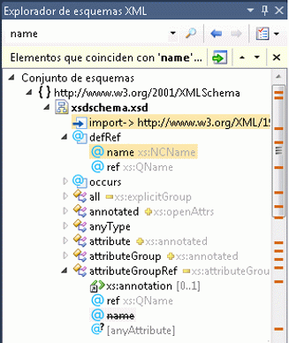

# Explorador de esquema XML
[!INCLUDE[vs2017banner](../code-quality/includes/vs2017banner.md)]

El Explorador de esquemas XML está integrado en Microsoft Visual Studio y en el Editor XML para permitirle trabajar con los esquemas del lenguaje de definición de esquema XML \(XSD\).Cuando se abre un archivo de esquema XML, el nodo **Conjunto de esquemas** aparece en el Explorador de esquemas XML.También aparecerán en el Explorador de esquemas XML todos los esquemas incluidos, importados o redefinidos para el archivo de destino, así como los archivos a los que se hace referencia mediante una instrucción `include` o `import`.  
  
 El Explorador de esquemas XML permite hacer lo siguiente:  
  
-   Obtener información general rápida del conjunto de esquemas.  
  
-   Examinar y desplazarse por el árbol.  
  
-   Realizar búsquedas específicas del esquema y de palabras clave.Para obtener más información, vea [Buscar en el conjunto de esquemas](../xml-tools/searching-the-schema-set.md).  
  
-   Agregar los resultados de la búsqueda a la vista Gráfico o Modelo de contenido  
  
-   Ordenar el árbol por documento, tipo o nombre.Para obtener más información, vea [Ordenar, filtrar y agrupar](../xml-tools/sorting-filtering-and-grouping-xml-schema-explorer.md).  
  
-   Abrir el Editor XML y saltar a las ubicaciones de código del archivo XSD.Para obtener más información, vea [Integración con el Editor XML](../xml-tools/integration-with-xml-editor.md).  
  
-   Generar XML de ejemplo para elementos globales.  
  
 El Explorador de esquemas XML proporciona una vista jerárquica del conjunto de esquemas mediante una vista de árbol.El Explorador de esquemas XML también proporciona búsqueda, filtrado, navegación y ordenación.Para tener acceso al Explorador de esquemas XML, realice una de las operaciones siguientes:  
  
-   Si se encuentra en la [vista Inicio](../xml-tools/start-view.md), haga clic en el vínculo **Explorador de esquemas XML**.  
  
-   Si se encuentra en la [vista Gráfico](../xml-tools/graph-view.md) o en la [vista Modelo de contenido](../xml-tools/content-model-view.md) y tiene nodos en su área de trabajo, use el menú contextual para seleccionar el Explorador de esquemas XML.  
  
-   También puede seleccionar el Explorador de esquemas XMLen el menú **Ver**.  
  
-   Puede obtener acceso al Explorador de esquemas XML desde un archivo .vb que tenga un literal XML de Visual Basic asociado con un archivo .xsd.Para ver el conjunto de esquemas en el Explorador de esquemas XML, haga clic con el botón secundario en un nodo XML de un literal XML o de una importación de espacios de nombres XML y seleccione el comando **Mostrar en Explorador de esquemas XML**.Para obtener más información, vea [Integración de los literales XML con el Explorador de esquemas XML](../xml-tools/integration-of-xml-literals-with-xml-schema-explorer.md).  
  
## Vista de árbol  
 El Explorador de esquemas XML muestra la información de conjunto de esquemas precompilada en una estructura de árbol.La estructura de árbol está organizada de la forma siguiente:  
  
-   En la parte superior está el nodo del conjunto de esquemas.  
  
-   El segundo nivel contiene los espacios de nombres.  
  
-   El tercer nivel contiene los archivos.  
  
-   El cuarto nivel contiene los nodos globales.Esto puede incluir elementos, grupos, tipos complejos, tipos simples, atributos, grupos de atributos e instrucciones `include`, `import` y `redefine`.  
  
 A continuación se muestra un ejemplo de estructura de árbol:  
  
   
  
## Selección y activación  
 Para resaltar y seleccionar un nodo, haga clic una vez en el Explorador de esquemas.  
  
 Para activar un nodo, haga doble clic en él o presione **Entrar** si el nodo está seleccionado.  
  
-   Al activar un nodo, se abre el archivo en el que está definido \(si no está abierto ya\) y se selecciona el nodo en dicho archivo.  
  
-   Al activar un nodo de archivo, se abre el archivo seleccionado \(si no está abierto ya\) y se resalta el nodo del `<schema>`.  
  
-   Al activar un nodo de espacio de nombres o de conjunto de esquemas no se realiza ninguna acción.  
  
## Arrastrar y colocar nodos  
 Puede arrastrar y colocar nodos globales, de archivo y de espacio de nombres en una vista del Diseñador XSD.Si la vista actual es la [vista Inicio](../xml-tools/start-view.md), al arrastrar un nodo hacia ella se abrirá la [vista Gráfico](../xml-tools/graph-view.md).Si la vista actual es la [vista Modelo de contenido](../xml-tools/content-model-view.md) o la vista Gráfico, la vista no cambiará al colocar un nodo sobre ella.  
  
 Al colocar los archivos en la vista, se agregarán todos los nodos globales del archivo al [Área de trabajo del Diseñador XSD](../xml-tools/xml-schema-designer-workspace.md).Al colocar los espacios de nombres en la vista, se agregarán al área de trabajo todos los nodos globales del espacio de nombres.El área de trabajo la comparten todas las vistas.  
  
 No es posible arrastrar y colocar nodos locales ni importaciones.  
  
## En esta sección  
  
-   [Buscar en el conjunto de esquemas](../xml-tools/searching-the-schema-set.md)  
  
-   [Ordenar, filtrar y agrupar](../xml-tools/sorting-filtering-and-grouping-xml-schema-explorer.md)  
  
-   [Menús contextuales](../xml-tools/context-menus-xml-schema-explorer.md)  
  
-   [Integración de los literales XML con el Explorador de esquemas XML](../xml-tools/integration-of-xml-literals-with-xml-schema-explorer.md)  
  
## Vea también  
 [Cómo: Agregar nodos al área de trabajo desde el Explorador de esquemas XML](../Topic/How%20to:%20Add%20Nodes%20to%20the%20Workspace%20from%20the%20XML%20Schema%20Explorer.md)